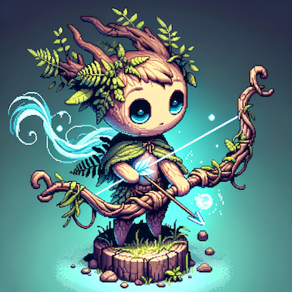
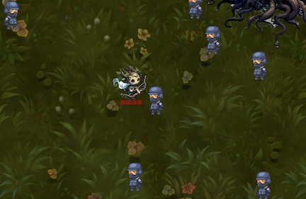

# TERRAN: And the Wrath of the Wildwoods

**TERRAN: And the Wrath of the Wildwoods** is a 2D top-down, rogue-like, wave-based game developed using the **Godot Engine**. The game focuses on fast-paced action, strategic environmental interactions, and immersive gameplay centered around defending the forest from waves of invaders. This project emphasizes dynamic mechanics, resource management, and engaging visual and audio design.

---

## **Project Details**

### **Gameplay Mechanics**
- **Wave-Based Combat:**
    - Players face escalating waves of enemies with increasing difficulty.
    - Boss enemies appear every 5–10 waves, requiring advanced strategies and ability use.
- **Abilities and Combat System:**
    - Four key-bound abilities (`Q`, `W`, `E`, `R`) include:
        - **Ranged Attacks**
        - **Area-of-Effect Abilities**
        - **Defensive Maneuvers**
        - **Ultimate Skills**
    - Resource management is crucial for executing abilities and sustaining combat.
    - Abilities can be upgraded and customized through skill trees.
- **Movement:**
    - **Point-and-Click Navigation** for precise positioning and evasion.
    - Smooth, responsive movement enhances player control.
  
---

### **Main Character**

- Terran is the forest spirit and the protagonist of the game.
- Designed with tree-like features and a magical bow, Terran embodies the forest's resilience and power.

---

### **Map Design and Environment**

- **Central Grove:** A critical area that must be defended. Large trees with strategic importance are located here.
- **Outer Ring and Pathways:** Trees encircle the grove, offering layers of defense and choke points.
- **Dynamic Battlefield:**
    - Environmental elements react to player actions.
    - Interactive features such as releasing spores, triggering barriers, or utilizing terrain for strategic advantage.
- **Randomized Placement:** Tree and enemy placement change between sessions for replayability.

---

## **Technical Details**

### **Godot Features and Tools Used**
1. **Physics and Movement:**
    - `CharacterBody2D`: Used for precise movement and collision handling.
    - `velocity` and `move_and_slide()`: Manage character navigation and real-time movement mechanics.
2. **Abilities and Preloaded Scenes:**
    - Abilities are managed via preloaded `.tscn` scenes:
        - **Verdant Arrow**
        - **Whisp's Wrath**
        - **Devouring Wolves**
        - **Slash**
        - **Indignation**
        - **Spectral Dash**
    - **Timers (`Timer` Nodes):**
        - Handle ability cooldowns and attack delays.
        - Examples: `iceSpearTimer`, `slashTimer`, `dashTimer`.
3. **Animations:**
    - `AnimationPlayer`: Controls character animations (e.g., "RUN" for movement).
    - Conditional animations such as sprite flipping and attack animations enhance visual clarity.
4. **Dynamic Interactions:**
    - **Signal System:**
        - Signals manage events like player death, ability usage, and level progression.
    - Environmental interactions include shaking trees, activating barriers, and spawning resources.
5. **Resource Management:**
    - Collected resources and upgrades are dynamically tracked using arrays (e.g., `collected_upgrades`).
    - GUI components like `HealthBar` and `ExperienceBar` visually display player stats.
6. **AI and Detection:**
    - Enemies use proximity detection (`_on_enemy_detection_area_body_entered`) for dynamic targeting and engagement.
    - Randomized spawn points increase replayability and challenge.
7. **Player Experience:**
    - Sound effects (`AudioStreamPlayer`) enhance immersion for events like leveling up and defeating enemies.
    - `Tween` nodes create smooth transitions for GUI elements and animations.

---

### **Progression and Leveling**
- **Experience System:**
    - Players gain experience through combat and completing waves.
    - Experience is tracked visually using `ExperienceBar` and level-up notifications.
    - Leveling unlocks new abilities and upgrades.
- **Upgrade System:**
    - Players collect upgrades to enhance abilities and defenses.
    - Examples of upgrades:
        - **Spell Cooldown Reduction**
        - **Increased Spell Size**
        - **Additional Ammo**
    - Randomized upgrade selection ensures varied gameplay each session.

---

### **Development Tools**
- **Godot Engine:** Core game engine for development.
- **GDScript:** Used for scripting gameplay mechanics, animations, and interactions.
- **Graphics and Audio:**
    - Custom sprites and animations designed using external tools.
    - Immersive audio effects enhance the gameplay experience.
- **Version Control:**
    - Managed through Git and GitHub for collaborative development and versioning.

---